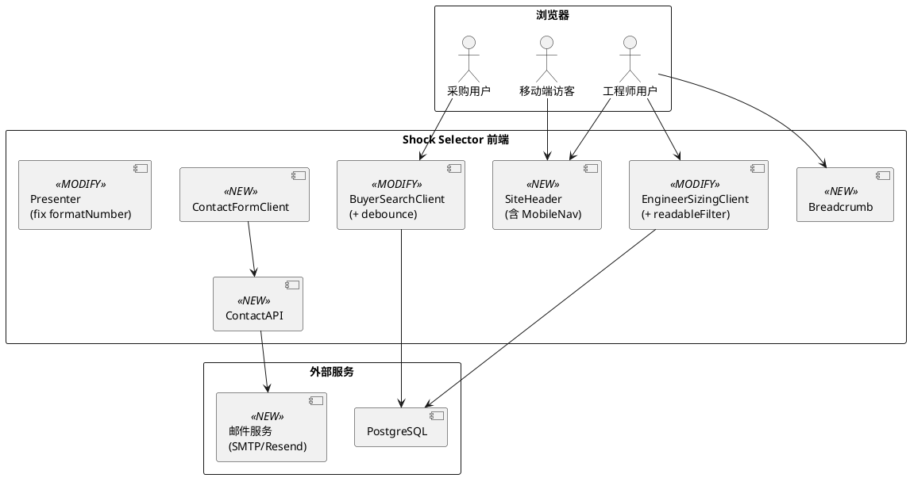

# **1. 实现模型**

## **1.1 上下文视图**



## **1.2 服务/组件总体架构**

### 改进项与组件映射

| 改进项 | 新增/修改组件 | 文件路径 | 类型 |
|--------|-------------|----------|------|
| 移动端导航 | `MobileNav` (新增) + `SiteHeader` (修改) | `components/layout/mobile-nav.tsx`, `components/layout/site-header.tsx` | 客户端组件 |
| 面包屑导航 | `Breadcrumb` (新增) | `components/ui/breadcrumb.tsx` | 服务端组件 |
| 采购自动搜索 | `BuyerSearchClient` (修改) | `components/marketing/buyer-search-client.tsx` | 客户端组件 |
| 选型结果可读化 | `ReadableFilter` (新增) + `EngineerSizingClient` (修改) | `components/selector/readable-filter.tsx`, `components/selector/engineer-sizing-client.tsx` | 客户端组件 |
| 联系表单 | `ContactFormClient` (新增) + `ContactAPI` (新增) | `components/contact/contact-form-client.tsx`, `app/api/contact/route.ts` | 客户端组件 + API Route |
| 未实现工况提示 | `EngineerSizingClient` (修改) | `components/selector/engineer-sizing-client.tsx` | 客户端组件 |
| formatNumber 修复 | `presenter.ts` (修改) | `lib/calculators/presenter.ts` | 纯函数 |

### 架构原则

1. **客户端/服务端分离**: 交互组件（MobileNav、ContactFormClient、BuyerSearchClient、EngineerSizingClient）为 `"use client"`，展示组件（Breadcrumb）为服务端组件
2. **复用现有数据源**: MobileNav 复用 SiteHeader 的 `copy` props 中的导航链接数据；Breadcrumb 基于路由自动生成
3. **渐进增强**: 所有改进不破坏现有桌面端（lg+）布局和功能
4. **i18n 一致性**: 新增文案通过 `site-copy.ts` 管理，支持 en/zh-cn 双语

## **1.3 实现设计文档**

### 1.3.1 移动端响应式导航

**方案**: 在 `SiteHeader` 中引入 `MobileNav` 客户端组件，lg 以下显示汉堡图标，点击展开全屏导航面板。

**SiteHeader 修改**:
- 在 `hidden lg:flex` 的导航区域旁，添加 `lg:hidden` 的汉堡按钮
- 汉堡按钮使用 `Menu` 图标（lucide-react），点击触发 MobileNav 展开
- MobileNav 接收 `navigation items` + `locale` + `localeNames` + `currentPath` 作为 props

**MobileNav 组件设计**:
- 使用 `useState<boolean>` 控制开/关
- 全屏覆盖层 (`fixed inset-0 z-50`)，背景 `bg-ink/95 backdrop-blur`
- 导航项纵向排列，当前项高亮（与桌面端一致）
- 语言切换器在底部，样式与桌面端胶囊式一致
- 关闭方式: X 图标 + 点击背景 + 选择导航项后自动关闭
- 动画: CSS transition `duration-300`，面板从右侧滑入

**响应式断点**:
- `lg:hidden` — 汉堡按钮仅在 lg 以下显示
- `hidden lg:flex` — 桌面导航仅在 lg 以上显示（保持不变）

### 1.3.2 面包屑导航

**方案**: 新增 `Breadcrumb` 服务端组件，根据当前路由和页面元数据自动生成层级路径。

**Breadcrumb 组件设计**:
- Props: `{ items: Array<{ label: string; href?: string }> }`
- 最后一项无 href（当前页），前面各项有 href 可点击
- 分隔符: `/` 或 chevron 图标，颜色 `text-steel/50`
- 当前项: `text-ink font-medium`
- 链接项: `text-steel hover:text-ink transition-colors`
- 容器: `flex items-center gap-2 text-sm`，与页面内容左对齐

**各页面集成**:
- 产品家族页: `[{label: "Products", href: "/products"}, {label: familyName}]`
- 产品型号页: `[{label: "Products", href: "/products"}, {label: familyName, href: familyHref}, {label: modelName}]`
- 工程师选型页: `[{label: "Sizing", href: "/selector/engineer"}]`
- 采购筛选页: `[{label: "Quick Filter", href: "/selector/buyer"}]`

**i18n**: 面包屑标签通过 site-copy 获取，支持多语言

### 1.3.3 采购筛选自动搜索

**方案**: 在 `BuyerSearchClient` 中为数值输入添加 500ms 防抖自动搜索。

**实现方式**:
- 新增 `useEffect` 监听 `filters` 变化
- 使用 `setTimeout` + `clearTimeout` 实现 500ms 防抖
- 防抖到期后调用 `runSearch(filters)`
- 保留手动搜索按钮（作为即时触发方式）
- 搜索中状态: 结果区域显示 `isPending` 加载指示器（替换当前的文本提示）

**防抖逻辑**:
```
filters 变化 → 清除上一个 timeout → 设置新 timeout(500ms) → 到期后 runSearch()
```

**边界处理**:
- 组件 unmount 时清除 timeout（useEffect cleanup）
- 下拉选择变化时立即搜索（不走防抖），保持现有行为
- 连续快速修改多个字段，只触发最后一次搜索

### 1.3.4 工程师选型结果可读化

**方案**: 新增 `ReadableFilter` 组件，将 JSON 筛选条件转换为结构化可读展示。

**ReadableFilter 组件设计**:
- Props: `{ filter: Record<string, number | string>, locale: Locale }`
- 内置字段映射表:
  ```
  minStrokeMm → { label: "行程", labelEn: "Stroke", operator: "≥", unit: "mm" }
  minEnergyPerCycleNm → { label: "单次能量", labelEn: "Energy/Cycle", operator: "≥", unit: "Nm" }
  minEnergyPerHourNm → { label: "每小时能量", labelEn: "Energy/Hour", operator: "≥", unit: "Nm" }
  minImpactForceN → { label: "冲击力", labelEn: "Impact Force", operator: "≥", unit: "N" }
  minThrustForceN → { label: "推力", labelEn: "Thrust Force", operator: "≥", unit: "N" }
  maxTotalLengthMm → { label: "总长度", labelEn: "Total Length", operator: "≤", unit: "mm" }
  threadSize → { label: "螺纹", labelEn: "Thread", operator: "=", unit: "" }
  familySlug → { label: "产品家族", labelEn: "Family", operator: "=", unit: "" }
  ```
- 未知字段: 使用原始 key 作为 label，值直接显示
- 展示格式: 每行一个条件，`label operator value unit`
- 样式: `bg-mist/50 rounded-xl p-4`，每行 `flex items-center gap-2`

**EngineerSizingClient 修改**:
- 将 `<pre>{JSON.stringify(result.filter, null, 2)}</pre>` 替换为 `<ReadableFilter filter={result.filter} locale={locale} />`

### 1.3.5 联系表单提交

**方案**: 新增 `ContactFormClient` 客户端组件 + `POST /api/contact` API Route。

**ContactFormClient 组件设计**:
- Props: `{ locale: Locale; copy: SiteCopy["contact"] }`
- 状态: `formData`, `errors`, `isSubmitting`, `submitResult`
- 字段: name(必填), email(必填), company(选填), phone(选填), message(必填)
- 前端校验: Zod schema（与后端共享）
- 提交: `fetch('/api/contact', { method: 'POST', body: JSON.stringify(formData) })`
- 成功: 显示成功提示 + 清空表单
- 失败: 显示错误提示 + 保留表单内容

**Contact API Route 设计**:
- `POST /api/contact` → 校验 → 速率限制 → 发送邮件 → 返回成功/失败
- 校验: Zod schema（name, email, company?, phone?, message）
- 速率限制: 基于 IP 的内存计数器（`Map<string, {count, windowStart}>`），每分钟 3 次
- 邮件发送: 使用 `nodemailer`（SMTP）或 `Resend` API，通过环境变量配置
- 环境变量: `CONTACT_EMAIL_TO`, `SMTP_HOST`, `SMTP_PORT`, `SMTP_USER`, `SMTP_PASS`（或 `RESEND_API_KEY`）

**Contact 页面修改**:
- 将现有纯 HTML form 替换为 `<ContactFormClient />`
- 保留左侧联系信息卡片不变

### 1.3.6 未实现工况变体提示

**方案**: 修改 `EngineerSizingClient` 中工况变体的展示逻辑，对未实现变体显示灰色 + "即将推出"标签。

**当前行为** (已部分实现):
- Entry 级别: `implementedVariantCount === 0` 的 entry 已有 `opacity-60` + disabled 处理
- Variant 级别: `visibleVariants` 已过滤掉 `!isImplemented` 的变体

**改进**:
- Variant 级别: 显示所有变体（包括未实现的），未实现的变体:
  - 样式: `opacity-50 cursor-not-allowed`
  - 标签: 右上角 `Badge` 组件显示 "Coming Soon" / "即将推出"
  - 点击: 无响应（或显示 tooltip "此工况路径即将推出"）
- Entry 级别: 保持现有 disabled 逻辑，但改进提示文案，列出即将推出的变体名称

### 1.3.7 formatNumber 函数修复

**方案**: 修复 `presenter.ts` 中的 `formatNumber` 函数，正确区分整数和小数格式化。

**实现**:
```ts
function formatNumber(value: number): string {
  if (!Number.isFinite(value)) return "—";
  if (Number.isInteger(value)) return String(value);
  // 小数: 最多2位，去除末尾零
  const formatted = value.toFixed(2).replace(/\.?0+$/, "");
  return formatted;
}
```

**行为**:
- `formatNumber(100)` → `"100"`
- `formatNumber(3.14)` → `"3.14"`
- `formatNumber(3.10)` → `"3.1"`
- `formatNumber(3.00)` → `"3"`
- `formatNumber(NaN)` → `"—"`

# **2. 接口设计**

## **2.1 总体设计**

| 接口 | 方法 | 用途 | 认证 |
|------|------|------|------|
| `/api/contact` | POST | 提交联系表单 | 无（速率限制） |

其他改进项（移动端导航、面包屑、自动搜索、可读化展示、工况提示、formatNumber）均为前端内部变更，不新增 API 接口。

## **2.2 接口清单**

### POST /api/contact

**Request Body**:
```json
{
  "name": "string (required, max 100)",
  "email": "string (required, RFC 5322)",
  "company": "string (optional, max 200)",
  "phone": "string (optional, max 50)",
  "message": "string (required, max 2000)",
  "locale": "string (required, enum locales)"
}
```

**Response 200**:
```json
{
  "success": true,
  "message": "Thank you for your message. We will get back to you soon."
}
```

**Response 400**:
```json
{
  "success": false,
  "errors": { "email": ["Invalid email format"] }
}
```

**Response 429**:
```json
{
  "success": false,
  "message": "Too many requests. Please try again later."
}
```

**Response 500**:
```json
{
  "success": false,
  "message": "Failed to send message. Please try again later or email us directly."
}
```

**Zod Schema** (前后端共享):
```ts
const ContactFormSchema = z.object({
  name: z.string().min(1).max(100),
  email: z.string().email().max(200),
  company: z.string().max(200).optional(),
  phone: z.string().max(50).optional(),
  message: z.string().min(1).max(2000),
  locale: z.enum(locales),
});
```

# **4. 数据模型**

## **4.1 设计目标**

本次改进以 UX 优化为主，不涉及数据库 Schema 变更。联系表单数据为瞬时提交（发送邮件后不持久化），无需新增数据表。

## **4.2 模型实现**

### 4.2.1 速率限制器（内存模型）

```ts
type RateLimitEntry = {
  count: number;
  windowStart: number; // Unix timestamp ms
};

// Map<ip, RateLimitEntry>
const rateLimiter = new Map<string, RateLimitEntry>();
```

- 窗口大小: 60 秒
- 窗口内最大请求数: 3
- 过期清理: 每次检查时清理超过 60 秒的窗口

### 4.2.2 面包屑数据模型

```ts
type BreadcrumbItem = {
  label: string;   // 显示文本（已本地化）
  href?: string;   // 跳转路径，无则表示当前页
};
```

### 4.2.3 筛选条件可读化映射模型

```ts
type FilterFieldMapping = {
  label: string;      // 中文标签
  labelEn: string;    // 英文标签
  operator: string;   // 比较运算符 (≥, ≤, =)
  unit: string;       // 物理单位 (mm, Nm, N)
};
```
