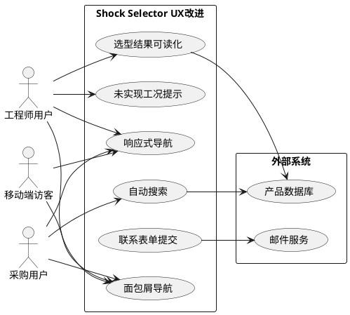
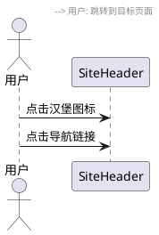
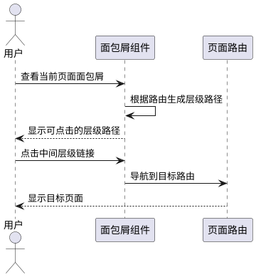
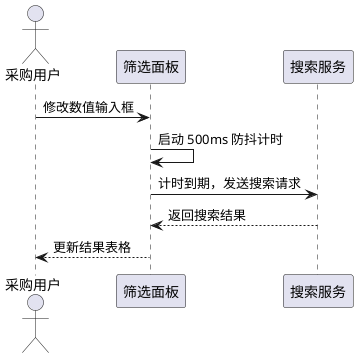
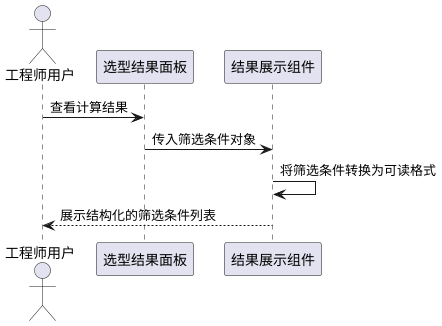
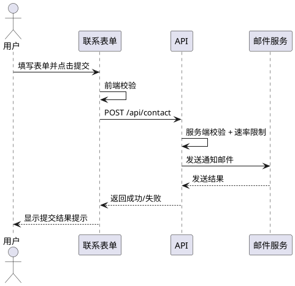
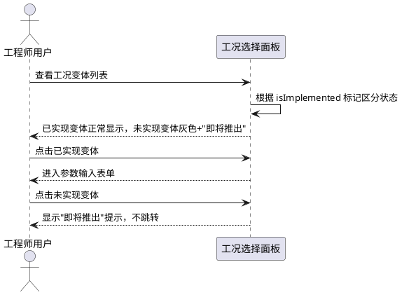

# **1. 组件定位**

## **1.1 核心职责**

本组件负责优化 Shock Selector 工业选型网站的布局交互体验和功能完善，实现移动端可用、操作便捷、功能闭环的用户体验。

## **1.2 核心输入**

1. 用户在移动端/桌面端的页面导航操作
2. 用户在采购筛选页的数值输入操作
3. 用户在工程师选型页的工况选择和参数输入
4. 用户在联系页的表单提交操作
5. 用户在产品详情页的面包屑导航操作

## **1.3 核心输出**

1. 响应式导航菜单（含移动端汉堡菜单）
2. 面包屑导航路径
3. 采购筛选自动搜索结果
4. 工程师选型结果的可读化展示
5. 联系表单提交成功/失败反馈
6. 未实现工况变体的友好提示

## **1.4 职责边界**

1. 不负责新增工况计算器的算法实现（仅处理未实现变体的 UI 提示）
2. 不负责 de/fr/it 语言翻译内容的补充（仅标记缺失状态）
3. 不负责产品图片资源的实际关联（仅处理图片缺失时的占位展示）
4. 不负责 Excel 导入脚本中硬编码路径的修复
5. 不负责新增单元测试覆盖

# **2. 领域术语**

**移动端导航**
: 在屏幕宽度小于 lg 断点（1024px）时，通过汉堡菜单图标触发的侧边栏或下拉导航面板。

**面包屑导航**
: 显示用户从首页到当前页面的层级路径，每级可点击跳转的导航组件。

**工况变体**
: 工程师选型中，同一工况入口下的不同驱动方式和载荷方向的组合，如"直线-外力-水平"。

**自动搜索**
: 用户修改筛选条件后，无需手动点击搜索按钮，系统自动触发搜索请求的行为。

**筛选条件可读化**
: 将工程师选型结果中的 JSON 格式筛选条件转换为用户可理解的自然语言描述。

# **3. 角色与边界**

## **3.1 核心角色**

- **工程师用户**：使用工况选型工具进行产品计算和匹配的专业技术人员，主要使用桌面端
- **采购用户**：使用快速筛选工具查找和比较产品的采购人员，可能使用移动端
- **移动端访客**：通过手机或平板浏览产品信息的潜在客户

## **3.2 外部系统**

- **邮件服务**：接收联系表单提交的内容，发送通知邮件
- **产品数据库**：提供产品搜索和筛选的数据支撑

## **3.3 交互上下文**

# **4. DFX约束**

## **4.1 性能**

1. 移动端导航菜单展开/收起动画 SHALL 在 300ms 内完成
2. 采购筛选自动搜索 SHALL 在用户停止输入 500ms 后触发（防抖）
3. 面包屑导航渲染 SHALL 不增加页面首屏加载时间超过 50ms

## **4.2 可靠性**

1. 联系表单提交 SHALL 在邮件服务不可用时优雅降级，显示"稍后重试"提示
2. 自动搜索 SHALL 在网络请求失败时保留上次成功的结果，显示错误提示

## **4.3 安全性**

1. 联系表单 SHALL 对所有输入字段进行服务端校验，防止 XSS 和注入攻击
2. 联系表单 SHALL 实施速率限制，同一 IP 每分钟最多提交 3 次

## **4.4 可维护性**

1. 移动端导航组件 SHALL 复用现有桌面端导航的链接数据源
2. 面包屑导航 SHALL 基于路由结构自动生成，无需手动配置

## **4.5 兼容性**

1. 移动端导航 SHALL 兼容 iOS Safari 和 Android Chrome 的最新两个主版本
2. 所有改进 SHALL 不破坏现有桌面端（lg 及以上）的布局和功能

# **5. 核心能力**

## **5.1 移动端响应式导航**

### **5.1.1 业务规则**

1. **汉堡菜单触发规则**：当视口宽度小于 1024px 时，SHALL 显示汉堡菜单图标替代桌面导航链接

   a. 验收条件：[视口宽度 < 1024px] → [导航链接隐藏，汉堡图标可见]

2. **菜单面板展开规则**：点击汉堡图标 SHALL 展开全屏或侧边导航面板，包含所有导航链接和语言切换器

   a. 验收条件：[点击汉堡图标] → [导航面板展开，包含所有导航项和语言切换]

3. **菜单面板关闭规则**：点击关闭图标、点击面板外区域、或选择导航项后 SHALL 关闭导航面板

   a. 验收条件：[点击关闭图标/面板外区域/导航项] → [导航面板关闭]

4. **语言切换规则**：移动端导航面板中 SHALL 包含语言切换功能，与桌面端行为一致

   a. 验收条件：[在移动端导航面板切换语言] → [URL 更新为对应 locale 前缀，页面内容切换]

### **5.1.2 交互流程**

### **5.1.3 异常场景**

1. **导航面板动画中断**

   a. 触发条件：用户在面板展开动画未完成时点击关闭

   b. 系统行为：立即停止展开动画，开始收起动画

   c. 用户感知：面板平滑收起，无闪烁

## **5.2 面包屑导航**

### **5.2.1 业务规则**

1. **产品详情页面包屑**：产品型号详情页 SHALL 显示"首页 > 产品中心 > [产品家族名] > [型号名]"的面包屑路径

   a. 验收条件：[访问产品型号详情页] → [显示完整层级面包屑，每级可点击]

2. **产品家族页面包屑**：产品家族详情页 SHALL 显示"首页 > 产品中心 > [产品家族名]"的面包屑路径

   a. 验收条件：[访问产品家族详情页] → [显示三级面包屑]

3. **工程师选型页面包屑**：工程师选型页 SHALL 显示"首页 > 工程师选型"的面包屑路径

   a. 验收条件：[访问工程师选型页] → [显示二级面包屑]

4. **采购筛选页面包屑**：采购筛选页 SHALL 显示"首页 > 采购快速筛选"的面包屑路径

   a. 验收条件：[访问采购筛选页] → [显示二级面包屑]

5. **面包屑链接规则**：面包屑中每一级 SHALL 为可点击链接，点击后跳转到对应页面；当前页级 SHALL 为纯文本不可点击

   a. 验收条件：[点击面包屑中的"产品中心"] → [跳转到产品中心页面]

### **5.2.2 交互流程**

### **5.2.3 异常场景**

1. **面包屑数据缺失**

   a. 触发条件：产品家族名称在当前语言下无翻译

   b. 系统行为：使用产品家族 key 作为回退显示文本

   c. 用户感知：面包屑正常显示，文本为英文 key

## **5.3 采购筛选自动搜索**

### **5.3.1 业务规则**

1. **数值输入防抖搜索**：当用户修改行程、能量、力值等数值输入框后，SHALL 在用户停止输入 500ms 后自动触发搜索

   a. 验收条件：[用户在行程输入框输入 50，停止输入 500ms] → [自动触发搜索，更新结果表格]

2. **下拉选择即时搜索**：类型和螺纹等下拉选择变化时，SHALL 立即触发搜索（保持现有行为）

   a. 验收条件：[用户选择类型"缓冲器"] → [立即触发搜索]

3. **搜索中状态指示**：搜索请求发出后、结果返回前，SHALL 在结果区域显示加载状态

   a. 验收条件：[搜索请求进行中] → [结果区域显示加载指示器]

4. **搜索按钮保留**：SHALL 保留手动搜索按钮，作为自动搜索的补充触发方式

   a. 验收条件：[页面仍显示搜索按钮] → [点击按钮可手动触发搜索]

### **5.3.2 交互流程**

### **5.3.3 异常场景**

1. **搜索请求失败**

   a. 触发条件：网络错误或服务端 500 错误

   b. 系统行为：保留上次成功结果，显示错误提示

   c. 用户感知：结果表格不变，顶部显示"搜索失败，请重试"提示

2. **连续快速输入**

   a. 触发条件：用户在 500ms 内连续修改多个数值

   b. 系统行为：只发送最后一次修改对应的搜索请求

   c. 用户感知：结果表格只更新一次，无多余闪烁

## **5.4 工程师选型结果可读化**

### **5.4.1 业务规则**

1. **筛选条件可读化展示**：工程师选型计算结果中的筛选条件 SHALL 以结构化的可读格式展示，而非原始 JSON

   a. 验收条件：[计算完成，结果包含筛选条件] → [以"行程 ≥ 50mm""能量 ≥ 100Nm"等格式展示，而非 JSON]

2. **筛选条件分组展示**：多个筛选条件 SHALL 按参数类型分组，每组显示参数名、比较符号和数值

   a. 验收条件：[筛选条件包含行程和能量] → [分行展示"行程 ≥ 50mm"和"能量 ≥ 100Nm"]

3. **数值单位展示**：每个筛选条件值 SHALL 附带正确的物理单位（mm、Nm、N）

   a. 验收条件：[行程筛选值为 50] → [显示"50mm"而非"50"]

### **5.4.2 交互流程**

### **5.4.3 异常场景**

1. **筛选条件字段未知**

   a. 触发条件：筛选条件中包含代码未映射的字段名

   b. 系统行为：使用原始字段名作为回退显示

   c. 用户感知：显示原始字段名和值，不影响其他条件的可读化展示

## **5.5 联系表单提交**

### **5.5.1 业务规则**

1. **表单校验规则**：提交前 SHALL 校验所有必填字段（姓名、邮箱、消息内容），邮箱 SHALL 符合标准格式

   a. 验收条件：[邮箱字段输入"abc"] → [显示"请输入有效的邮箱地址"错误提示]

2. **表单提交规则**：校验通过后 SHALL 将表单数据发送到后端 API，后端 SHALL 将内容转发到配置的邮箱地址

   a. 验收条件：[填写有效表单并点击提交] → [显示"提交成功"提示，相关邮箱收到通知]

3. **提交反馈规则**：提交成功 SHALL 显示成功提示并清空表单；提交失败 SHALL 显示错误提示并保留表单内容

   a. 验收条件：[提交成功] → [显示成功提示，表单清空]

   b. 验收条件：[提交失败] → [显示错误提示，表单内容保留]

4. **速率限制规则**：同一 IP 每分钟 SHALL 最多允许 3 次提交

   a. 验收条件：[同一 IP 1分钟内第4次提交] → [返回 429 状态码，显示"请求过于频繁"提示]

### **5.5.2 交互流程**

### **5.5.3 异常场景**

1. **邮件服务不可用**

   a. 触发条件：邮件服务连接失败或超时

   b. 系统行为：记录错误日志，返回通用失败响应

   c. 用户感知：显示"提交失败，请稍后重试或直接发送邮件至 xxx@ekd.com"

2. **速率限制触发**

   a. 触发条件：同一 IP 短时间内多次提交

   b. 系统行为：返回 429 状态码

   c. 用户感知：显示"请求过于频繁，请稍后再试"

3. **前端校验失败**

   a. 触发条件：必填字段为空或邮箱格式无效

   b. 系统行为：阻止提交，在对应字段下方显示错误提示

   c. 用户感知：表单不提交，看到具体字段错误提示

## **5.6 未实现工况变体提示**

### **5.6.1 业务规则**

1. **未实现变体标识规则**：标记为 `isImplemented: false` 的工况变体 SHALL 在选择界面中显示为灰色不可选状态，并附带"即将推出"提示

   a. 验收条件：[工况变体 isImplemented 为 false] → [该选项灰色显示，hover 时显示"即将推出"提示]

2. **已实现变体可选规则**：标记为 `isImplemented: true` 的工况变体 SHALL 正常显示为可选状态

   a. 验收条件：[工况变体 isImplemented 为 true] → [该选项正常颜色显示，可点击选择]

3. **禁止进入未实现变体**：点击未实现的工况变体 SHALL 不进入参数输入表单

   a. 验收条件：[点击灰色"即将推出"的变体] → [不跳转，显示提示信息]

### **5.6.2 交互流程**

### **5.6.3 异常场景**

1. **所有变体均未实现**

   a. 触发条件：某个工况入口下所有变体都标记为未实现

   b. 系统行为：整个入口卡片显示为灰色不可选状态

   c. 用户感知：入口卡片灰色，显示"即将推出"标签

## **5.7 formatNumber 函数修复**

### **5.7.1 业务规则**

1. **整数格式化规则**：当数值为整数时，SHALL 直接显示整数部分，无小数点

   a. 验收条件：[formatNumber(100)] → [返回 "100"]

2. **小数格式化规则**：当数值为小数时，SHALL 保留最多 2 位小数，去除末尾零

   a. 验收条件：[formatNumber(3.14)] → [返回 "3.14"]

   b. 验收条件：[formatNumber(3.10)] → [返回 "3.1"]

   c. 验收条件：[formatNumber(3.00)] → [返回 "3"]

### **5.7.2 交互流程**

无交互流程，纯函数修复。

### **5.7.3 异常场景**

1. **非数值输入**

   a. 触发条件：传入 NaN 或非数值类型

   b. 系统行为：返回 "—" 占位符

   c. 用户感知：显示破折号而非 "NaN"

# **6. 数据约束**

## **6.1 联系表单数据**

1. **name**：必填，最大长度 100 字符
2. **email**：必填，符合 RFC 5322 邮箱格式，最大长度 200 字符
3. **company**：选填，最大长度 200 字符
4. **message**：必填，最大长度 2000 字符
5. **phone**：选填，最大长度 50 字符

## **6.2 面包屑导航数据**

1. **label**：必填，面包屑显示文本，最大长度 50 字符
2. **href**：必填，跳转路径，以 / 开头的有效 URL 路径
3. **isCurrent**：布尔值，标记是否为当前页面（不可点击）

## **6.3 筛选条件可读化数据**

1. **parameterLabel**：必填，参数的本地化显示名称（如"行程""能量"）
2. **operator**：必填，比较运算符（≥、≤、>、<、=）
3. **value**：必填，数值
4. **unit**：必填，物理单位（mm、Nm、N）
